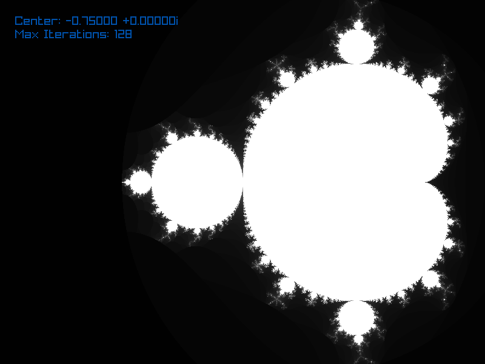

# Go RayLib: Mandelbrot 

A quick implementation of a visualization of the Mandelbrot set using Go and the [RayLib bindings](https://github.com/gen2brain/raylib-go). 

Use the mouse to pan around, and scroll wheel to zoom. Arrow keys up / down will increase / decrease the number of iterations (resulting in a more detailed visualization, but slower computation of each texture).

## Running the Project

- Ensure you have installed the requirements for RayLib, as per the [raylib-go README](https://github.com/gen2brain/raylib-go).
- Ensure you have Go 1.23 or later installed (although earlier versions may work, just change the `go.mod` file first).
- Clone the repository.
- Run `go build .`, followed by `./Go-RayLib-Mandelbrot`. 
    - The first build may take some time, as you will build the RayLib backend too. Future builds will be much faster!
